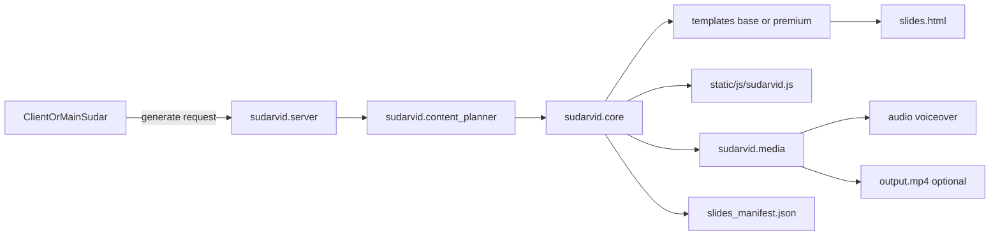

# SudarVid Standalone and Integration Architecture

This document maps current architecture and defines boundaries so SudarVid stays standalone while integrating cleanly into the main Sudar project.

## Current Architecture (Implemented)

Core pipeline:

- Planning: `sudarvid/content_planner.py`
- Assembly/render orchestration: `sudarvid/core.py`
- HTML templating: `templates/base.html.j2`
- Runtime player logic: `static/js/sudarvid.js`
- API surface + async jobs: `sudarvid/server.py`
- Theme catalog: `sudarvid/themes.py`
- Optional sprite lesson path: `sudarvid/sprite_lessons.py`

## Mode Separation

### Standalone Mode

SudarVid runs independently with:

- local FastAPI server (`python -m uvicorn sudarvid.server:app --reload`)
- direct HTTP generation (`POST /generate`)
- local render/download endpoints (`/render/{job_id}`, `/download/...`)
- output artifacts stored under `output/<job_id>/...`

### Integrated Mode

Main Sudar should consume SudarVid via stable contracts:

- **Library path:** call `generate_video(GenerationConfig)` from `sudarvid/core.py`
- **Service path:** HTTP contract (`/generate`, `/status/{job_id}`, `/render/{job_id}`)

Integration must avoid direct coupling to internal template/runtime internals.

## Recommended Integration Boundary

Expose/consume only:

- `GenerationConfig` fields (topic, audience, language, theme, pedagogy context)
- job lifecycle and output file paths
- generated output artifacts (`slides.html`, manifest, audio, optional mp4)

Avoid external reliance on:

- internal prompt text
- Jinja template internals
- runtime DOM class names

## Target Upgrade Boundary (Premium Engine)

Introduce a premium pathway beside the current deck pathway:

- `engine_mode=classic` keeps existing behavior.
- `engine_mode=premium` uses course-scene planning and premium runtime output.

Both modes should share:

- job API
- output conventions
- TTS/image/media pipeline where possible

## Dataflow Diagram

## Migration Principle

Do not break existing clients. Add premium capability as additive configuration, validate on benchmark courses, then expand default usage gradually.

